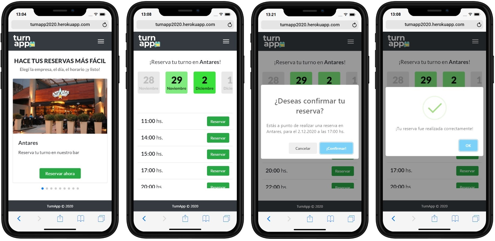

# Turnapp :calendar:

Final project for the subject Web Lab IV (UTN University)

[View live demo](http://turnapp2020.herokuapp.com/) :globe_with_meridians:

## About the application :computer:
Turnapp is a web application to easily connect companies that want to offer shifts for their services
and users who want to reserve those shifts.

## License :balance_scale:
MIT 

## Authors :black_nib:
* **Nicolás Cappabianca** - [LinkedIn](https://www.linkedin.com/in/nicolascappabianca/)
* **Lucas Galarce** - [LinkedIn](https://www.linkedin.com/in/galarce-lucas/)